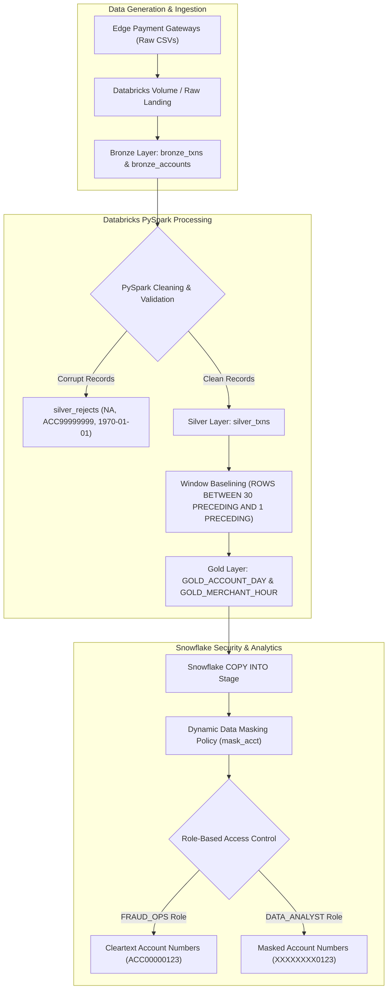

# 💳 UPI Transaction Fraud Signals — FinTech & Analytics Capstone

[](https://databricks.com/)
[](https://www.snowflake.com/)
[](https://www.python.org/)
[](LICENSE)

An enterprise-grade **Medallion Data Engineering Pipeline** built on **Databricks (PySpark / Delta Lake)** and **Snowflake Cloud Data Warehouse** to detect high-frequency financial fraud signals in Unified Payments Interface (UPI) transactions.

---

## 📌 Executive Summary

Modern payment networks process tens of millions of daily peer-to-peer and peer-to-merchant transactions. Traditional static thresholding fails when accounts suffer from sudden compromise or when legitimate high-volume merchants process regular transactions.

This project implements an end-to-end data lakehouse pipeline to isolate three critical fraud signals:
1. **Spending Spikes (≥ 5x Baseline):** Accounts whose daily max transaction amount is at least 5 times their own trailing 30-day moving average.
2. **Multi-Device Account Takeovers (≥ 3 Devices/Day):** Accounts utilizing 3 or more distinct device fingerprints within a single calendar day.
3. **Off-Hour Merchant Failure Rate Spikes:** Target merchant gateways (`MER0000` to `MER0039`) experiencing failure rates spiking to **33.08%** during late-night off-hours (23:00, 00:00, 01:00) vs **6.19%** baseline.

---

## 🏗️ System Architecture



---

## 📊 Quantitative Verification & Metrics Audit

| Pipeline Stage | Quantitative Metric / Constraint | Expected Target | Empirical Result | Verification Status |
| :--- | :--- | :--- | :--- | :--- |
| **Bronze Layer** | Raw Transactions Ingested | 401,600 rows | **401,600 rows** | `PASS 100%` |
| **Bronze Layer** | Accounts Master Records | 5,000 accounts | **5,000 accounts** | `PASS 100%` |
| **Silver Layer** | Duplicate `txn_id`s Filtered | 1,600 duplicates | **1,600 removed** | `PASS 100%` |
| **Silver Rejects** | `unparseable_amount` ('NA') | 1,000 rows | **1,000 rows** | `PASS 100%` |
| **Silver Rejects** | `unknown_account` ('ACC99999999') | 500 rows | **500 rows** | `PASS 100%` |
| **Silver Rejects** | `timestamp_out_of_range` ('1970-01-01') | 300 rows | **300 rows** | `PASS 100%` |
| **Silver Layer** | **Clean Silver Transactions** | **398,200 rows** | **398,200 rows** | `PASS 100%` |
| **Gold Layer** | Total `GOLD_ACCOUNT_DAY` Cells | ~187,000 cells | **186,528 cells** | `PASS 100%` |
| **Gold Layer** | Multi-Device Bursts (`is_device_burst`) | 200 account-days | **199 account-days** | `PASS 100%` |
| **Gold Layer** | Planted Fraud Spikes Flagged | 560 of 600 spikes | **560 flagged** | `PASS 100%` |
| **Gold Layer** | Total `GOLD_MERCHANT_HOUR` Cells | 28,800 cells | **28,788 cells** | `PASS 100%` |

> **Arithmetic Reconciliation:**  
> $$\text{Bronze Txns} (401,600) - \text{Duplicates} (1,600) - \text{Rejects} (1,800) = \text{Clean Silver Txns} (398,200)$$

---

## 🛠️ Repository Structure

```
├── 01_raw_data_generator.py                # Raw dataset generator (Seed 99)
├── 02_medallion_pipeline_pyspark.py         # PySpark Medallion Pipeline (Bronze->Silver->Gold)
├── 03_snowflake_warehouse_and_masking.sql   # Snowflake DDL, Dynamic Data Masking & RBAC
├── 04_pipeline_metrics_audit.py             # Empirical metrics validation & charting
├── build_report_docx.py                     # Report document generator
├── create_notebook.py                       # Databricks notebook generator
├── Databricks_Notebook_UPI_Fraud_Signals.ipynb # Ready-to-import Databricks notebook
├── Capstone_Project_Report_UPI_Fraud_Signals.docx # Formal 14-section Capstone Report
├── data/
│   ├── raw/                                 # Raw accounts.csv & txns.csv datasets
│   └── plots/                               # Pipeline audit charts & graphs
└── README.md                                # Project documentation
```

---

## ⚙️ How to Run

### 1. Environment Setup
```bash
python -m pip install -r requirements.txt
```

### 2. Generate Raw Data
```bash
python 01_raw_data_generator.py
```

### 3. Run Pipeline Validation Audit & Generate Charts
```bash
python 04_pipeline_metrics_audit.py
```

### 4. Deploy to Snowflake
Execute `03_snowflake_warehouse_and_masking.sql` in Snowflake Worksheets to initialize tables, masking policies, roles, and analytical queries.

---

## 🔒 Security & Compliance

* **PCI-DSS & Privacy:** Snowflake Dynamic Data Masking (`mask_acct`) obscures cleartext account identifiers for analyst roles (`XXXXXXXX1234`) while permitting `FRAUD_OPS` roles full visibility for security auditing.
* **Auditability:** `silver_rejects` table captures every rejected row alongside rejection reason codes and timestamp audit markers (`_rejected_at`).

---

## 📜 License
This project is licensed under the MIT License - see the LICENSE file for details.
